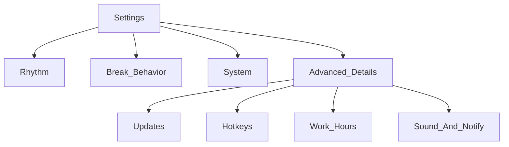

# Cat Break — handoff контекста (чат, июнь 2026)

Документ для **восстановления контекста в новом чате** или для нового разработчика. Дополняет [PROJECT_CONTEXT.md](PROJECT_CONTEXT.md).

**Репозиторий:** https://github.com/anatoly-kulishov/CatBreak  
**Ветки:** `main` (stable), `develop` (работа). PR: `develop` → `main`.  
**Версия на develop:** **1.0.6** (см. `package.json`).  
**Последний релевантный коммит:** `dbdd719` — fix prepare-icons skip.

---

## Промпт для нового чата

```
Проект: Cat Break — Electron tray timer + fullscreen cat break overlay.
Repo: https://github.com/anatoly-kulishov/CatBreak
Ветки: main (stable), develop (работа). PR: develop → main.

Прочитай docs/PROJECT_CONTEXT.md, docs/CHAT_HANDOFF.md, docs/DESIGN_SYSTEM.md, CHANGELOG.md.
Entry: main.js, preload.js, src/settings.*, src/break.*, lib/platform.js, landing/download.js.
Не подписывать билды codesign --deep. Windows: signAndEditExecutable: false.
```

---

## 1. Что это за приложение

**Cat Break** — desktop-утилита на **Electron** (Node ≥20) для перерывов для глаз.

| Слой | Поведение |
|------|-----------|
| **Tray** | Таймер работа/перерыв, меню: старт, отложить, micro-break, demo, settings, quit |
| **Break** | Полноэкранный overlay на мониторах, WebM-кот, countdown, упражнения, skip |
| **Settings** | Длительности, idle-pause, strict, звук, язык EN/RU, обновления |
| **Лендинг** | `landing/` на GitHub Pages, скачивание с Releases |

**Философия UX (решение в чате):** это маленькая tray-утилита, не «панель управления». Настройки должны быть минимальными; редкое — в advanced или tray menu. Ориентиры: Stretchly, Time Out, Big Stretch, Workrave.

**Настройки на диске:** `{userData}/settings.json`.

**Один процесс:** `requestSingleInstanceLock`, второй запуск открывает Settings.

---

## 2. Архитектура

```
main.js              # tray, tick 1s, IPC, break/settings windows, updates
preload.js           # window.catBreak (contextBridge)
lib/platform.js      # tray, break window flags, icons
lib/autostart.js     # launch at login (macOS/Windows)
lib/i18n.js          # locales, {{param}}
lib/notifications.js
lib/releases.js      # GitHub Releases API
lib/displays.js      # выбор мониторов (если есть в ветке)
lib/hotkeys.js       # глобальные hotkeys (если есть в ветке)
lib/schedule.js      # рабочие часы, пауза до завтра
lib/stats.js         # статистика дня
src/settings.html/js/css
src/break.html/js/css
locales/en.json, ru.json
assets/              # neko1/2.webm, meow.mp3, trayIcon*.png, app-icon-1024.png
build/               # icon-source.png + icon.icns/ico/png (НЕ удалять!)
landing/             # GitHub Pages
```

### Жизненный цикл таймера

| Состояние | Поведение |
|-----------|-----------|
| **Work** | `workSecondsLeft` уменьшается каждую секунду |
| **Idle** | Если `powerMonitor.getSystemIdleTime()` ≥ `idlePauseMinutes` — таймер не тикает |
| **Pre-break** | За N сек до конца work — optional notification (`notifyBeforeBreak`) |
| **Break** | `onBreak=true`, окна на display(s), `breakSecondsLeft` тикает |
| **End break** | Анимация выхода кота → `endBreak()` → снова work timer |

**Важно в `main.js`:** `breakExitRequested` только через `requestBreakExit()` (баг 1.0.0).

### IPC / preload

Renderer: `window.catBreak` (`preload.js`), `contextIsolation: true`.

Ключевые каналы: `get-settings`, `save-settings`, `skip-break`, `start-demo-break`, `break-init`, `break-tick`, `settings-updated`.

---

## 3. Хронология чата

### Фаза A — релиз 1.0.7 (обсуждалось / частично в другой сессии)

Планировалось в одном релизе: дисплеи, hotkeys, рабочие часы, статистика, onboarding, кольцо прогресса на break, micro-break, автосохранение, Playwright, `theme.css` и т.д.

На **текущем develop (1.0.6)** многого из этого в Settings **нет** — UI проще (см. §5).

### Фаза B — UX-ревью

- Settings **перегружен** для простой утилиты.
- Кольцо прогресса на break **плохо** сочетается с крупными цифрами (смещение, обрезка).
- Onboarding-overlay в Settings — лишний шум; «плавающая карточка» с пресетами — сломанный onboarding.

### Фаза C — план упрощения (согласован)

**На главном экране Settings:**

- **Ритм:** пресеты 55/5, 50/10, 25/5 + `workMinutes` / `breakMinutes`
- **Перерыв:** `notifyBeforeBreak`, `showExercises`, `strictBreak`, `idlePauseMinutes`
- **Система:** язык, `launchAtLogin`, `breakOnAllDisplays` + picker экранов

**Убрать / спрятать:**

- Onboarding overlay
- Micro-break кнопки в Settings (оставить в tray)
- Pause until tomorrow из main Settings (есть в tray)
- Demo break — в advanced
- Hotkeys, work hours, notify seconds, meow volume, updates UI — в `<details> Дополнительно`
- Убрать тяжёлый `settings-dock` внизу
- Кнопка Save не обязательна при autosave

**Break overlay:**

- Убрать SVG-кольцо прогресса полностью
- Оставить MM:SS + лапка + пульсация `countdown--soon` (последние 10 с)

### Фаза D — tray на macOS

**Проблемы пользователя:**

- «Не вижу приложение в bar»
- Ошибка `Unable to set login item: Operation not permitted`

**Причины и предложенные фиксы:**

1. В packaged app **Dock скрыт** — приложение живёт в menu bar (справа вверху).
2. `trayTemplate.png` (16×16) почти невидима — лучше `trayIcon@2x.png` (22px).
3. Длинный текст `До перерыва 55:00` в menu bar **обрезается** — показывать только `55:00`, полный текст в tooltip.
4. `setLoginItemSettings` в `npm start` (unsigned) → `Operation not permitted` — **не вызывать autostart в dev** (`!app.isPackaged` в `lib/autostart.js`).
5. В dev **не скрывать Dock** (`hideDockIfNeeded` только при `app.isPackaged`).

### Фаза E — npm install

`npm i` падает на `prepare` → `Missing build/icon-source.png`, если папка `build/` удалена или застейджена как deleted.

**Фикс (закоммичен, `dbdd719`):** если нет `icon-source.png`, но есть готовые `build/icon.png`, `build/icon.icns`, `assets/app-icon-1024.png` — skip с warning.

**Восстановление вручную:** `git restore build/` → `npm i`.

**npm cache EACCES:** `sudo chown -R $(id -u):$(id -g) ~/.npm` (отдельная проблема, не блокирует `npm i`).

---

## 4. Текущее состояние develop (на момент handoff)

### Settings UI (фактический)

Секции: **Общие** (updates + язык), **Расписание** (пресеты + minutes + idle), **Поведение** (notify, sound, exercises, strict, launch at login).

Кнопки: Save, Demo. Footer: версия, update status, check updates.

**Нет в UI:** onboarding, displays picker, hotkeys, work hours, advanced panel, autosave без Save.

### Break overlay

Countdown: **цифры + лапка**, **без кольца** прогресса.

### Tray (develop, до tray-фиксов)

- Иконка: `trayIcon.png` на macOS
- Title: `До перерыва …` (длинный текст)
- Dock всегда скрыт на macOS
- Autostart без guard для dev

### Что из чата может быть не в develop

| Изменение | Статус на develop |
|-----------|-------------------|
| Упрощённый Settings (3 секции + Advanced) | План есть, **может отсутствовать** |
| Tray: короткий title + trayIcon@2x | Обсуждено, **может отсутствовать** |
| Autostart skip в dev | Обсуждено, **может отсутствовать** |
| prepare-icons skip | **Закоммичено** (`dbdd719`) |

Перед работой: `git log`, `git diff main...develop`, читать актуальные `src/settings.html`, `lib/platform.js`.

---

## 5. Backlog / не в scope

| Задача | Заметка |
|--------|---------|
| Apple notarization | Долго, не UI |
| Linux autostart | Только mac/win в autostart |
| Electron e2e в CI | Позже |
| Подпись Windows | SmartScreen |

**Не планируется:** light theme, аккаунты, несколько профилей таймера, смена кота.

---

## 6. macOS — как найти приложение

1. `npm start` → смотреть **правый верхний угол** menu bar.
2. Ищите **лапку** и/или **таймер** (`55:00`).
3. **ПКМ** по tray — меню Cat Break.
4. **Системные настройки → Пункт управления → Панель меню** — если пункт скрыт.
5. После tray-фиксов в dev — также иконка в **Dock**.

---

## 7. Команды разработчика

```bash
npm i              # prepare; нужна build/icon-source.png или skip
npm start          # electron .
npm run prepare    # иконки из build/icon-source.png
npm test           # node:test (если есть в ветке)
npm run dist:mac
```

**Не удалять:** `build/icon-source.png`, `build/icon.icns`, `assets/trayIcon@2x.png`.

---

## 8. Ограничения и подводные камни

- Без code signing (macOS Gatekeeper, SmartScreen).
- `quitAndInstall` на macOS без Apple signing часто не работает — ручная установка из Releases.
- `deprecated` warnings в npm — от electron-builder, не блокер.
- Settings/Break — dark legacy palette; лендинг — cyan DS (`DESIGN_SYSTEM.md`).
- **Не использовать `codesign --deep`** на post-build — ломало запуск на чужих Mac.
- Windows: `signAndEditExecutable: false` в package.json.

---

## 9. Стиль работы с автором

- Тон: кратко, по-русски, без воды.
- Коммиты/PR — только по явной просьбе.
- Не создавать README без запроса.
- Минимальный diff, не переусложнять.
- EN + RU для новых строк в `locales/*.json`.
- Код из репозитория цитировать как `startLine:endLine:path`.

---

## 10. Структура упрощённого Settings (целевая)



**Ключевые файлы для реализации:** `src/settings.html`, `src/settings.js`, `src/settings.css`, `locales/en.json`, `locales/ru.json`.

---

## 11. Ссылки

| Ресурс | URL |
|--------|-----|
| Repo | https://github.com/anatoly-kulishov/CatBreak |
| Releases | https://github.com/anatoly-kulishov/CatBreak/releases |
| PROJECT_CONTEXT | [docs/PROJECT_CONTEXT.md](PROJECT_CONTEXT.md) |
| DESIGN_SYSTEM | [docs/DESIGN_SYSTEM.md](DESIGN_SYSTEM.md) |
| CHANGELOG | [CHANGELOG.md](../CHANGELOG.md) |
