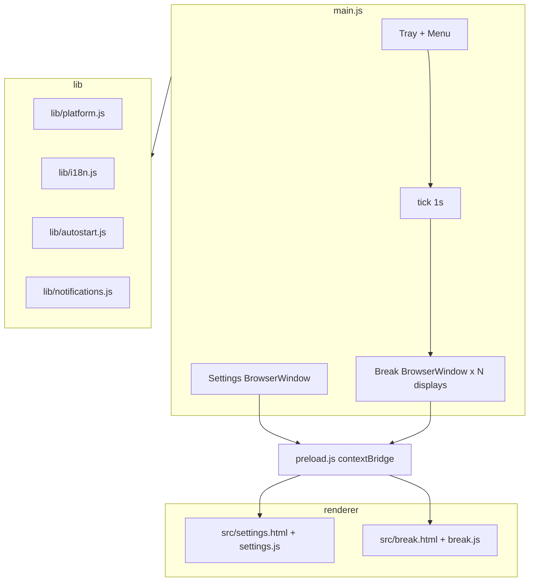

# Cat Break — контекст проекта (onboarding)

Документ для **нового чата / нового разработчика**: что это за приложение, как устроено, где что лежит, на что не наступать.

**Связанные документы:**

| Документ | Зачем |
|----------|--------|
| [DESIGN_SYSTEM.md](DESIGN_SYSTEM.md) | Цвета, лендинг, иконки |
| [LANDING_PAGES.md](LANDING_PAGES.md) | GitHub Pages, `#download-platform` |
| [README.md](README.md) | Установка по платформам |
| [CHANGELOG.md](../CHANGELOG.md) | Версии и история |

**Репозиторий:** https://github.com/anatoly-kulishov/CatBreak  
**Ветки:** `main` (stable), `develop` (работа). PR: `develop` → `main`.  
**Версия:** см. `package.json` (сейчас **1.0.5**).

---

## 1. Что это

**Cat Break** — desktop-приложение на **Electron** (Node ≥20): напоминания о перерыве для глаз.

- Таймер **работа / перерыв** в **system tray**
- По окончании работы — **полноэкранный overlay на всех мониторах** с WebM-котом
- Настройки: длительность, idle-pause, упражнения, strict mode, звук, уведомление, autostart
- UI: **EN / RU** (`locales/en.json`, `locales/ru.json`)
- Сборки: **macOS** (dmg/zip), **Windows** (nsis/portable), **Linux** (AppImage/deb) — **без code signing**

Отдельно: статический **лендинг** в `landing/` (скачивание с GitHub Releases, GitHub Pages).

---

## 2. Архитектура (кратко)



**Процесс один** (`requestSingleInstanceLock`). Нет главного окна — только tray; второй запуск открывает Settings.

**Настройки на диске:** `{userData}/settings.json` (см. `SETTINGS_PATH` в `main.js`).

---

## 3. Жизненный цикл таймера

| Состояние | Поведение |
|-----------|-----------|
| **Work** | `workSecondsLeft` уменьшается каждую секунду |
| **Idle** | Если `powerMonitor.getSystemIdleTime()` ≥ `idlePauseMinutes` — таймер **не тикает** |
| **Pre-break** | За 60 с до конца work — optional notification (`notifyBeforeBreak`) |
| **Break** | `onBreak=true`, окна на каждом `display`, `breakSecondsLeft` тикает |
| **End break** | Анимация выхода кота → `endBreak()` → снова work timer с полным `workMinutes` |

**Важные функции в `main.js`:**

- `tick()` — сердце логики; **не** выставлять `breakExitRequested` до `requestBreakExit()` (баг 1.0.0)
- `startBreak({ demo, seconds })` — demo = 30 с из tray или Settings
- `requestBreakExit({ fast })` — IPC + анимация; `playSound` если включено `soundOnBreakEnd` (и при досрочном выходе)
- `postponeBreak(5|10)` — только когда **не** onBreak
- Первый запуск без `settings.json` автоматически открывает Settings.

---

## 4. Карта файлов

```
main.js              # tray, timers, IPC, break/settings windows
preload.js           # window.catBreak API для renderer
package.json         # scripts, electron-builder targets

lib/
  platform.js        # OS: tray title, break window flags, tray icon path
  i18n.js            # locales, createTranslator, {{param}} substitution
  autostart.js       # launch at login (macOS/Windows only)
  notifications.js   # Electron Notification

src/
  settings.html/js/css   # окно настроек
  break.html/js/css      # fullscreen break overlay

locales/en.json, ru.json
assets/
  neko1.webm, neko2.webm   # cat videos (large)
  meow.mp3                 # end-of-break sound
  trayIcon*.png
  app-icon-1024.png        # generated

build/
  icon-source.png      # исходник иллюстрации (1024, без alpha)
  icon.png/.icns/.ico  # generated (npm run prepare)

scripts/
  prepare-icons.js   # squircle app icons + landing/app-icon.png
  update-meow.sh       # обновить meow из preview.mp3

landing/               # GitHub Pages (не Electron)
  index.html, styles.css, download.js, app-icon.png

docs/                  # install guides, DESIGN_SYSTEM, этот файл
.github/workflows/
  ci.yml               # syntax check
  landing-pages.yml    # deploy landing/ on push to main
```

---

## 5. Настройки (DEFAULT_SETTINGS)

```js
{
  workMinutes: 55,
  breakMinutes: 5,
  idlePauseMinutes: 2,
  showExercises: true,
  strictBreak: false,      // без кнопки Skip, closable=false на break window
  locale: "auto",          // "en" | "ru" | "auto"
  notifyBeforeBreak: true,
  soundOnBreakEnd: true,
  launchAtLogin: false,    // UI скрыт на Linux (canUseLoginItemSettings)
}
```

Сохранение: IPC `save-settings` → merge с DEFAULT → `saveSettings()` → при смене locale — `broadcastBreakLocaleUpdate()`.

---

## 6. IPC / preload API

| Канал | Направление | Назначение |
|-------|-------------|------------|
| `get-settings` | invoke | settings + strings + version + releasesUrl |
| `save-settings` | invoke | сохранить settings |
| `skip-break` | invoke | `requestBreakExit({ fast: true })` |
| `break-init` | main → break | payload: totalSeconds, strings, strictBreak, demo… |
| `break-tick` | main → break | `{ secondsLeft }` |
| `break-exit-request` | main → break | `{ fast, playSound }` |
| `break-locale-update` | main → break | новые strings при смене языка в Settings |
| `settings-updated` | main → settings | push после save |

Renderer: **`window.catBreak`** (`preload.js`), `contextIsolation: true`.

Break overlay CSP: `default-src 'self'; media-src 'self'; … script-src 'self'`.

---

## 7. Break UI (`src/break.js`)

- Два видео `neko1` / `neko2`: slide-in, sleep, exit animation
- Countdown крупно слева; side panel: hint, exercises, skip
- **`playEndMeow()`** — `assets/meow.mp3`, fallback Web Audio synth
- Strict mode: skip hidden, close window → fast exit

---

## 8. Platform notes (читать перед правками)

| OS | Особенности |
|----|-------------|
| **macOS** | Dock hidden; tray **title** с таймером; double-click tray → Settings; **unsigned** — Gatekeeper, см. `docs/en/MACOS_INSTALL.md` |
| **Windows** | `signAndEditExecutable: false` в package.json (иначе winCodeSign/7zip symlink error); SmartScreen |
| **Linux** | autostart UI hidden; AppImage/deb |

**Не использовать `codesign --deep`** на post-build — ломало запуск на чужих Mac (см. CHANGELOG 1.0.0).

**Иконки:** `npm run prepare` после смены `build/icon-source.png`. App icon ≠ landing icon (прозрачный кот без плитки).

---

## 9. Сборка и релизы

```bash
npm start              # dev
npm run prepare        # icons
npm run dist:mac       # dmg + zip (+ MACOS_INSTALL.md в dist/)
npm run dist:mac:x64   # Intel Mac
npm run dist:win
npm run dist:linux
```

Артефакты: `dist/`. Релизы — **GitHub Releases** (лендинг тянет `/releases/latest` API).

CI (`ci.yml`): `npm ci`, `prepare`, `node --check` на main.js, lib/*, preload, landing/download.js.

---

## 10. Лендинг

- `#download-platform` — macOS / Windows / Linux dropdowns, файлы из GitHub API
- `detectPlatform()` — подсветка «ваша система», OS-specific install hint
- Деплой: push `landing/**` в **main** → workflow `landing-pages.yml`
- Дизайн-токены: `landing/styles.css` (см. DESIGN_SYSTEM.md)

Лендинг **не** входит в electron-builder `files`.

---

## 11. i18n

- Файлы: `locales/en.json`, `locales/ru.json`
- Ключи: `app.*`, `tray.*`, `settings.*`, `break.*`, `notify.*`
- Плейсхолдеры: `{{clock}}`, `{{minutes}}` и т.д.
- HTML: `lang` на settings/break выставляется из resolved locale

Новая опция в Settings → добавить ключи в **оба** JSON + UI в `settings.html/js`.

---

## 12. Типичные задачи → куда лезть

| Задача | Файлы |
|--------|--------|
| Логика таймера / tray | `main.js` |
| Поведение OS / multi-monitor | `lib/platform.js` |
| Новая настройка | `main.js` DEFAULT + IPC, `settings.*`, `locales/*` |
| Текст break overlay | `locales/*`, `src/break.js` |
| Звук конца перерыва | `assets/meow.mp3`, `src/break.js`, `scripts/update-meow.sh` |
| Иконка / tray | `build/icon-source.png`, `scripts/prepare-icons.js`, `assets/trayIcon*` |
| Лендинг / скачивание | `landing/*`, `docs/LANDING_PAGES.md` |
| Установка пользователям | `docs/en/*`, `docs/ru/*` |
| CI | `.github/workflows/ci.yml` |

---

## 13. Известные ограничения

- **Обновления:** этап 1 — GitHub API + ручная загрузка (`lib/releases.js`); этап 2 — `electron-updater` в упакованной сборке (`lib/updater.js`), fallback на API если нет `latest-*.yml` на релизе. CI: `.github/workflows/release.yml` публикует артефакты и yml по тегу `v*`. macOS auto-install требует подпись Apple; без подписи — скачивание в приложении + установка как на сайте.
- Нет подписи бинарников
- Settings/Break UI — **legacy** палитра (orange CTA); лендинг — новая cyan DS (см. DESIGN_SYSTEM)
- `landing/` и docs могут быть в `develop` раньше, чем в `main`
- GitHub API на лендинге: rate limit / CORS нет (client-side fetch); при 404 — fallback на Releases page

---

## 14. Промпт для нового чата (можно вставить)

```
Проект: Cat Break — Electron tray timer + fullscreen cat break overlay.
Repo: anatoly-kulishov/CatBreak, ветка develop/main.
Прочитай docs/PROJECT_CONTEXT.md, docs/DESIGN_SYSTEM.md.
Entry: main.js, preload.js, src/break.js, src/settings.js, landing/download.js.
Не подписывать билды codesign --deep. Windows: signAndEditExecutable: false.
```

---

## 15. Чеклист перед PR

- [ ] `node --check` на затронутые `.js`
- [ ] EN + RU для новых строк
- [ ] `npm run prepare` если менялся `icon-source.png`
- [ ] Не коммитить secrets / `.env`
- [ ] macOS/Win/Linux нюансы если трогали platform/autostart/notifications
